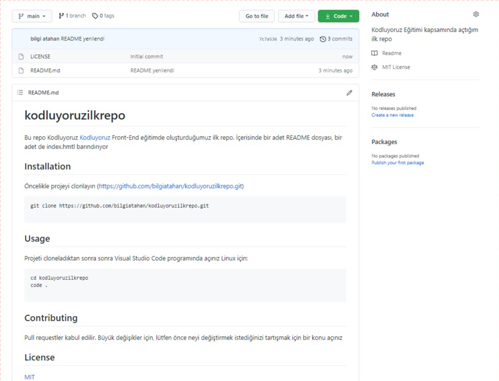

# kodluyoruzilkrepo
Bu repo Kodluyoruz [Kodluyoruz](https://www.kodluyoruz.org/) Front-End eğitimde oluşturduğumuz ilk repo. İçerisinde bir adet README dosyası, bir adet de index.hmtl barındırıyor

## Installation
Öncelikle projeyi clonlayın (https://github.com/bilgiatahan/kodluyoruzilkrepo.git)

```
git clone https://github.com/bilgiatahan/kodluyoruzilkrepo.git

```

## Usage 
Projeti cloneladıktan sonra sonra Visual Studio Code programında açınız
Linux için:

```
cd kodluyoruzilkrepo
code .

```

## Contributing

Pull requestler kabul edilir. Büyük değişikler için, lütfen önce neyi değiştirmek istediğinizi tartışmak için bir konu açınız

## License

[MIT](https://choosealicense.com/licenses/mit/)

